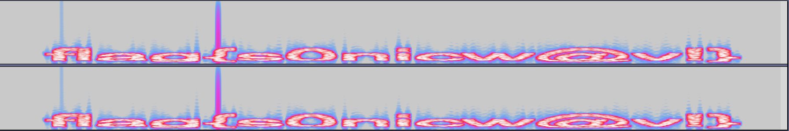

## Can you hear me now?

### Writeup by Trent (teerix)

Category: Forensics

```
How bout now?

Included: ctf3.wav
```

The wav file does not produce any legible sounds, but if you place it in audio software (I used audacity) and changed the wave
mode to spectrogram, a flag can be seen as shown below:



Flag: flag{s0nicw@v!}
