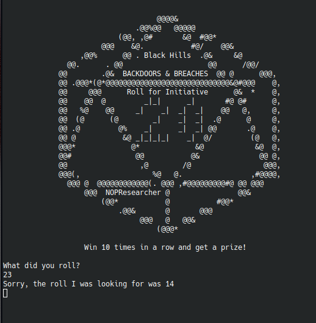

## Roll for Initiative 1

### Writeup by Trent (teerix)

Category: Programming

```
Are you ready for some Backdoors & Breaches? Let's get this game started!
164.90.147.2:1234 
```

When connecting to the challenge manually, the goal is to roll 10 correct rolls in a row for the flag. If you get it wrong,
the program states what the correct roll is.



Running it a couple times shows that the correct rolls are static, meaning this could easily be done manually, but here is the script to automate it:

```py
from pwn import *

rolls = []

while True:
	conn = remote('164.90.147.2', 1234)
	conn.recvuntil(b'What did you roll?')


	if len(rolls) != 10:
		for r in rolls:
			conn.send(f'{r}')
			conn.recvuntil(b'Roll again!\n')
			
		conn.send(b'21')
		conn.recvuntil(b'I was looking for was ')
		line = conn.recvline()
		rolls.append(int(line.strip()))
	else:
		for i in range(9):
			conn.send(f'{rolls[i]}')
			conn.recvuntil(b'Roll again!\n')
		conn.send(f'{rolls[9]}')
		flag = conn.recvline().strip()
		print(str(flag, 'utf-8'))
		break
```

Flag: TS{BHISLetsRollThis}
