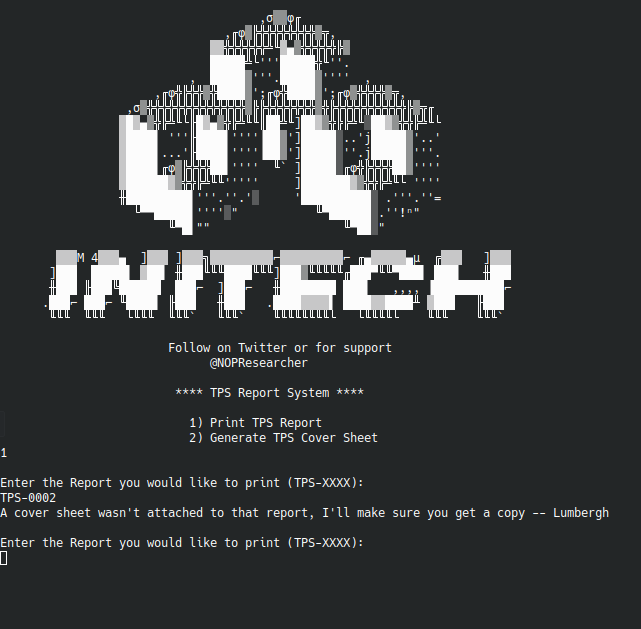

## TPS Report System

### Writeup by Trent (teerix)

Category: Programming

```
What is the password protected TPS report? (format: TS{TPS-XXXX})

161.35.239.216:5000
```

Essentially the goal is to sift through TPS-0000 to TPS-9999 and figure out what report asks for a password.

If a report does not exist, it gives the message:

A cover sheet wasn't attached to that report, I'll make sure you get a copy -- Lumbergh



So we can filter any report numbers that result in the above message, and log any docs that do not have it.

```py
from pwn import *

for i in range(7384, 9999):
	doc = f'TPS-{i:04}'
	print(f'Testing doc {doc}')
	conn = remote('161.35.239.216', 5000)
	conn.recvuntil('2)')
	conn.recvline()
	conn.send(b'1')
	conn.recvuntil(b'Enter the Report you would like to print')
	conn.recvline()
	conn.send(doc)
	line = conn.recvline()
	if line != b"A cover sheet wasn't attached to that report, I'll make sure you get a copy -- Lumbergh\n":
		with open('reports.txt', 'a') as f:
			f.write(doc +  '\n')
	conn.close()
```

One of the reports logged, TPS-8352, is the correct report.

Flag: TS{TPS-8352}
